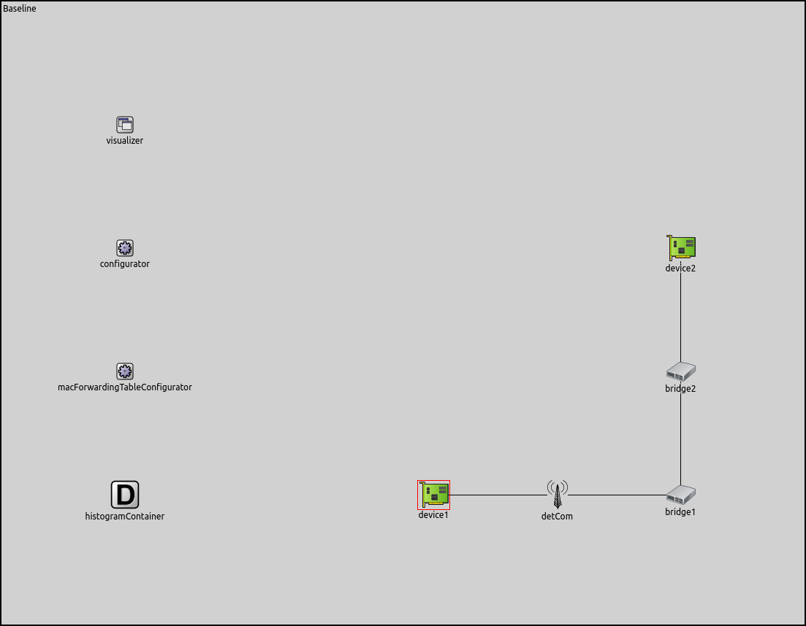
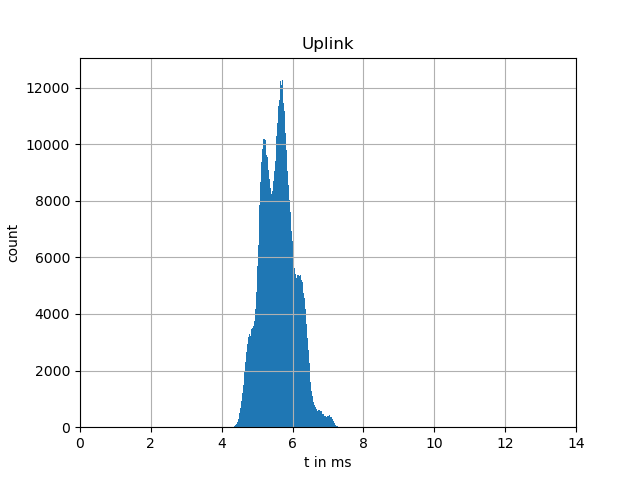
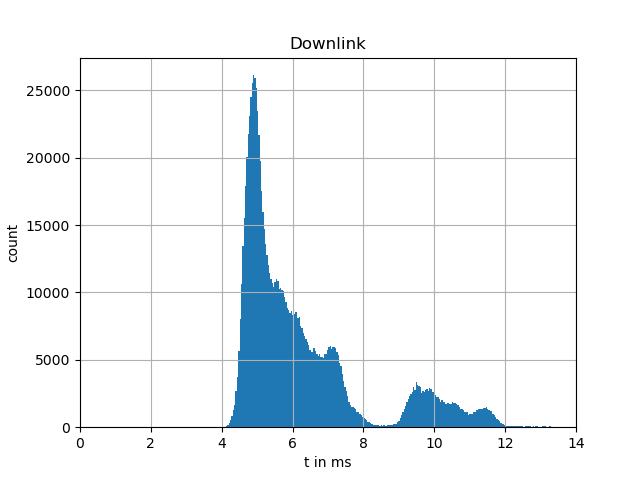

Baseline Showcase
=================

The baseline scenario simulates a simple line topology with a single 6GDetCom node and further wired TSN bridges.
Despite its simplicity, it can be used to showcase and test the core functions of the simulator framework, such as the :ned:`DetComDelayer` component and the :ned:`Histogram` module.

Showcase Design and Implementation
----------------------------------

In more detail, it is a set of scenarios with a :ned:`DetCom` node in the center and a wired or wirelessly connected device or bridge on either side.
This is one example scenario:

In this scenario, we use two different histograms shown below to configure PDs, one for the uplink direction of the wireless network and one for the downlink direction, respectively.

+-----------+------------+
| |uplink|  | |downlink| |
+-----------+------------+

Results
-------

We mainly use the Baseline scenario to explore the capabilities of our implemented components of the simulation framework, in particular, the :ned:`DetComDelayer`.
This includes analyzing how the resulting simulated packet delay corresponds to the given input histograms above.

Histogram
^^^^^^^^^

The following figures the distribution of the resulting packet delays in both, the uplink and downlink direction.
By comparing the distribution of the result of the simulation to the configured distributions from above, we see that the simulated distributions follow the given distributions.

+---------------+----------------+
| |uplink_res|  | |downlink_res| |
+---------------+----------------+

.. |uplink_res| image:: uplink_result.png
   :width: 100% 

.. |downlink_res| image:: downlink_result.png
   :width: 100%

Random Walk
^^^^^^^^^^^

Additionally, we use the Baseline scenario to showcase our random walk distribution as described in Section 2.2.3.
As an exemplary configuration, we replace the downlink distribution with following the random walk configuration:

.. code-block:: ini

   *.detCom.dstt[0].bridging.delayLayer.delayDownlink = randomWalk(5.5ms,normal(0ms,100us))

The following figure shows the resulting end-to-end delay in uplink and downlink directions. The orange line depicting the downlink delay shows the characteristic random walk pattern centered around the mean value of 5.5 ms.

.. image:: randomwalk.png
   :width: 50%
