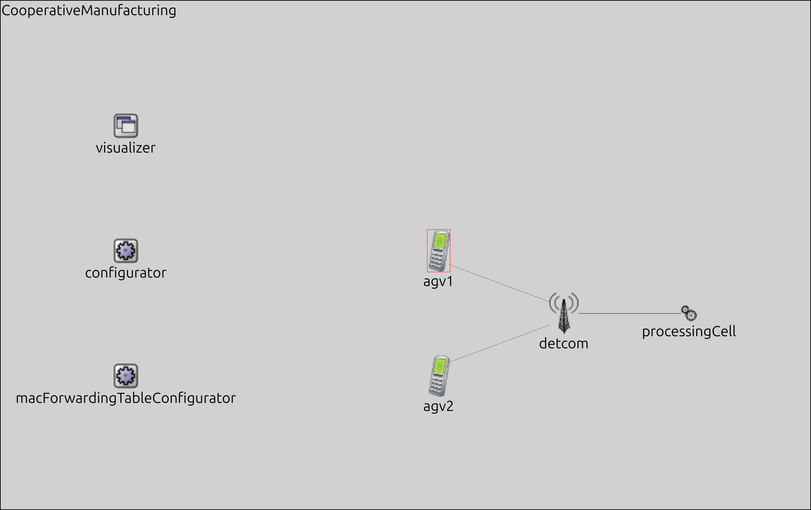
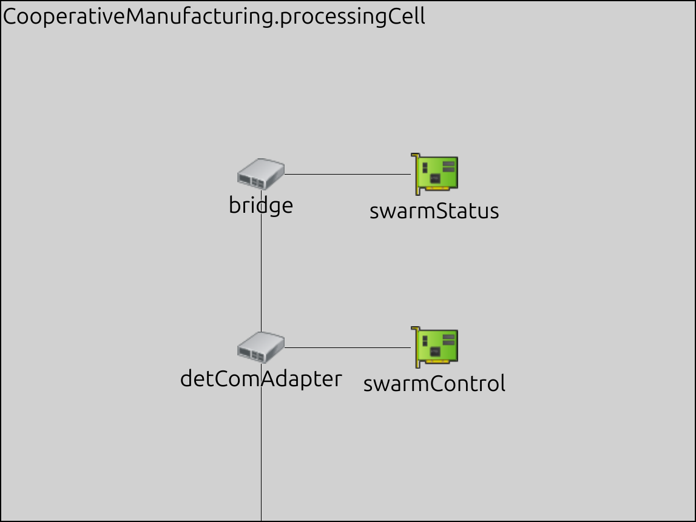
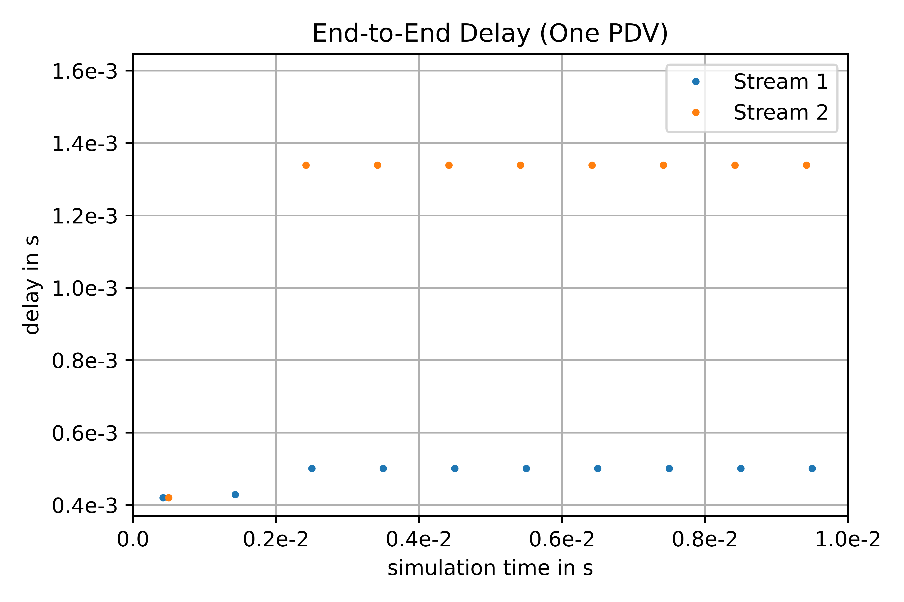
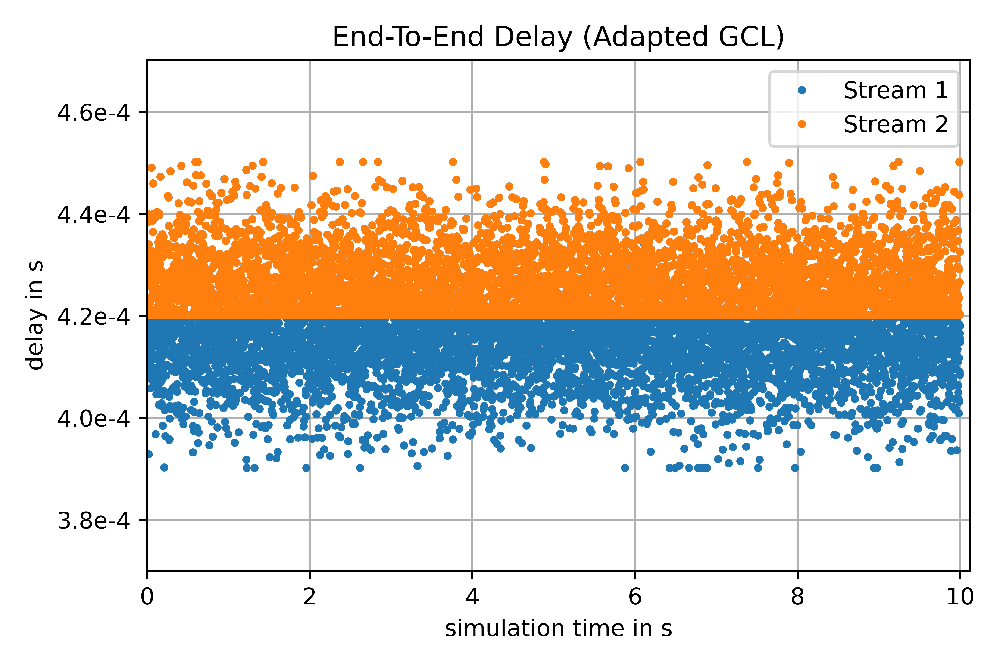

Industrial Automation Showcase
==============================

The Industrial Automation showcase has been derived from a use case of D1.1: DETERMINISTIC6G Use Cases and Architecture Principles [DET23-D11].
One purpose of this scenario is to validate and evaluate concepts for wireless-friendly end-to-end scheduling as designed in WP3.
The design of such scheduling approaches is ongoing work at the time of writing this document.
Therefore, we only present first preliminary evaluation results of one approach for wireless-friendly IEEE802.1Qbv scheduling with a TAS described in D3.1 6G Convergence Enablers Towards Deterministic Communication Standards [DET23-31], mainly to show the usefulness of the simulation framework to validate and evaluate such mechanisms.
This scenario consists of two Automated Guided Vehicles (AGVs), which connect wirelessly to a processing cell when they are close to the cell.
The AGVs can communicate with each other wirelessly to coordinate their movement as a swarm, and they can communicate with the cell to coordinate the movement relative to the components of the cell.
These movements could implement processing steps like bending, turning, inserting, or connecting individual or multiple parts.
Although the AGVs are mobile in this scenario and the connection might be intermittent (only when the AGVs are close to the cell and registered with the cell), our first implementation of the scenario does not include the simulation of mobility.
Therefore, we assume that the AGVs are constantly connected to the processing cell.

Showcase Design and Implementation
----------------------------------

The topology of the scenario is depicted below.
It consists of one :ned:`DetCom` node which connects wirelessly to two :ned:`AGV` devices (agv1 and agv2).

+-----------+----------+
| |network| |  |cell|  |
+-----------+----------+

Moreover, the :ned:`DetCom` has a wired connection to a :ned:`ProcessingCell`.
Note that the processing cell contains a wired TSN network segment as shown in the figure above, which illustrates the details of the :ned:`ProcessingCell` component (right figure) to show the sub-components implemented by processing cell.
The processing cell consists of two TsnSwitches (detComAdapter and bridge) and two TsnDevices (swarmControl and swarmStatus), which also send and receive data.

The traffic in this showcase includes six different streams:

#. Stream 1: From agv1 to processingCell.swarmStatus
#. Stream 2: From agv2 to processingCell.swarmStatus
#. From agv1 to agv2
#. From agv2 to agv1
#. From processingCell.swarmControl to agv1
#. From processingCell.swarmControl to agv2

This setup allows for analyzing the influence of PDVs onto streams and explore the capabilities of common and wireless-friendly scheduling algorithms as shown in the next sub-section.

Preliminary Results
-------------------

In this sub-section, we discuss the first results from the Industrial scenario evaluation.
We first simulate scheduling with a TAS schedule calculated under the assumption of constant packet delay.
Although this is an unrealistic assumption, it is still often made in existing scheduling approaches for wired TSN networks.
Then, we show the impact of PDV onto the schedule calculated for ideal assumptions. Finally, we show how a wireless-friendly schedule will improve the robustness to PDV.

Influence of PDVs onto other streams
^^^^^^^^^^^^^^^^^^^^^^^^^^^^^^^^^^^^

In our first evaluation, we only consider the first two streams, i.e., from agv1.interToCell to processingCell.swarmStatus and from agv2.interToCell to processingCell.swarmStatus.
First, we assume constant transmission and propagation delay for both streams using the following delay configuration for the :ned:`DetCom`.
Note, that these delay values include all delay components of the wireless links (dotted lines in the network), i.e., also the propagation delay, transmission delay, delay because of retransmissions, etc.
All other links (solid lines in Figure 21) behave like default EthernetLinks in INET.

.. code-block:: ini

    *.detCom.dstt[*].delayUplink = 100us

We then use a “non-wireless-friendly” scheduling approach similar to [DN16], designed for wired TSN networks, assuming very small and constant delay, i.e. zero PDV.
This approach aims to minimize the end-to-end delay and keeps the streams close together in time (“back-to-back” scheduling) to minimize the required number of GCL entries.
With this scheduling approach, the calculated schedule is show below:

Stream 1:

+------------------------------+------------------------------+-----------+--------------------+-------------------+
| sender                       | receiver                     | start     | end (transmission) | end (propagation) |
+==============================+==============================+===========+====================+===================+
| agv1                         | detCom.dstt[0]               | 0 μs      | 80 μs              | 80.05 μs          |
+------------------------------+------------------------------+-----------+--------------------+-------------------+
| detCom.dstt[0]               | detCom.nwtt                  | 80.05 μs  | 80.05 μs           | 80.05 μs          |
+------------------------------+------------------------------+-----------+--------------------+-------------------+
| detCom                       | processingCell.bridge1       | 180.05 μs | 260.05 μs          | 260.10 μs         |
+------------------------------+------------------------------+-----------+--------------------+-------------------+
| processingCell.bridge1       | processingCell.bridge2       | 260.10 μs | 340.10 μs          | 340.15 μs         |
+------------------------------+------------------------------+-----------+--------------------+-------------------+
| processingCell.bridge2       | processingCell.swarmStatus   | 340.15 μs | 420.15 μs          | 420.20 μs         |
+------------------------------+------------------------------+-----------+--------------------+-------------------+

Stream 2:

+------------------------------+------------------------------+-----------+--------------------+-------------------+
| sender                       | receiver                     | start     | end (transmission) | end (propagation) |
+==============================+==============================+===========+====================+===================+
| agv2                         | detCom.dstt[1]               | 80.96 μs  | 160.96 μs          | 161.01 μs         |
+------------------------------+------------------------------+-----------+--------------------+-------------------+
| detCom.dstt[1]               | detCom.nwtt                  | 161.01 μs | 161.01 μs          | 161.01 μs         |
+------------------------------+------------------------------+-----------+--------------------+-------------------+
| detCom                       | processingCell.bridge1       | 261.01 μs | 341.01 μs          | 341.06 μs         |
+------------------------------+------------------------------+-----------+--------------------+-------------------+
| processingCell.bridge1       | processingCell.bridge2       | 341.06 μs | 421.06 μs          | 421.11 μs         |
+------------------------------+------------------------------+-----------+--------------------+-------------------+
| processingCell.bridge2       | processingCell.swarmStatus   | 421.11 μs | 501.11 μs          | 501.16 μs         |
+------------------------------+------------------------------+-----------+--------------------+-------------------+

Note, that Stream 2 starts later than Stream 1 to ensure there is no overlap on the first consecutive link from detCom to processingCell.detComAdapter.
Stream 2 is scheduled directly after the transmission of Stream 1 except for the inter-frame gap (IFG) of 0.96 μs in our setup.
Note, that there is no transmission and propagation delay on the wireless link before the detCom node.
These delays are part of the delay configured in Listing 8 and are shown as bold entries in the tables.
The calculated schedule leads to the GCL configuration for the detCom node as shown below:

.. code-block:: ini

    [Gcl]
    *.detCom.nwtt.eth[*].macLayer.queue.transmissionGate[0].initiallyOpen = false
    *.detCom.nwtt.eth[*].macLayer.queue.transmissionGate[0].offset = 0s
    *.detCom.nwtt.eth[*].macLayer.queue.transmissionGate[0].durations = []

    *.detCom.nwtt.eth[*].macLayer.queue.transmissionGate[1].initiallyOpen = true
    *.detCom.nwtt.eth[*].macLayer.queue.transmissionGate[1].offset = 819.95us
    *.detCom.nwtt.eth[*].macLayer.queue.transmissionGate[1].durations = [161us,839us]

The simulation results below show that all packets arrive at their pre-calculated time with the expected end-to-end delay of 420.2 μs.
Note, as the end-to-end delay is equal for both streams only one stream is visible in the diagram.

.. image:: constant.png
   :width: 50%

Obviously, the assumption of constant delays is unrealistic already in wired TSN networks but even to a larger extent in wireless networks.
Therefore, next we add PDV to observe the impact on scheduling.
We add PDV to Stream 1 and observe its impact on Stream 2 without additional PDV, using the previous schedule calculated for constant delays.
To this end, we re-run the simulation with the following delay configuration:

.. code-block:: xml

    <delays>
	    <uplink device="agv1">normal(100us,10us)</uplink>
	    <uplink device="agv2">100us</uplink>
    </delays>

Without any changes to our schedule or the GCL this leads to the simulation results in the following figure.
The figure shows, that the streams only arrive within their calculated time in the first cycle.
In the second cycle, the frame of stream 1 arrives at the GCL later than calculated leading to an end-to-end delay of ~429 μs (instead of the calculated 420 μs).
Thus, by the time the frame of stream 1 is completely transmitted the remaining duration of the open gate is not long enough anymore to transmit the frame of stream 2.
This leads to the frame of stream 2 being queued until the beginning of the next cycle.
In the rest of the simulation, as soon as the gate opens in the next cycle, the queued frame of stream 2 of the previous cycle is transmitted first (resulting in and end-to-end delay of ~1340 μs).
During this transmission, the frame of stream 1 of the current cycle arrives which is then transmitted immediately afterwards.
As the open gate slot is completely filled with the frame of stream 2 from the previous cycle and the frame of stream 1 of the current cycle, the frame of stream 2 of the current cycle again has to be queued until the gate opening in the next cycle.
Without dropping any packets (e.g. by using ingress filtering and policing) or using additional gate opening times, there is no possibility to recover from this.

Adapting the GCL on the DetCom node by Considering PDV
^^^^^^^^^^^^^^^^^^^^^^^^^^^^^^^^^^^^^^^^^^^^^^^^^^^^^^

In a third simulation, we analyze what happens if we adapt the GCL according to the PDV of Stream 1.
In this run, we want to guarantee that Stream 1 arrives within the same cycle with a reliability of 99.7 %. For our chosen normal distribution with μ=100 μs and σ=10 μs this corresponds to a PDV interval of [μ-3σ,μ+3σ]=[70 μs,130 μs].
However, with a small probability, packets could still arrive outside this interval. One approach to protect other streams is to drop frames arriving outside of this interval.
To this end, we could use the filtering feature from IEEE 802.1Qci Per-Stream Filtering and Policing implemented by INET.
To mimic the behavior of filtering as done by IEEE 802.1Qci, we can simply truncate the PD distribution using the following configuration.
Then no packets are sent that have delays outside the filtering time window.

.. code-block:: xml

    <delays>
    	<uplink device="agv1">min(100us+30us,max(100us-30us,normal(100us,10us)))</uplink>
    	<uplink device="agv2">100us</uplink>
    </delays>

We now need to reconfigure the GCL to open 30 μs earlier and stay open for an additional 30 μs:

.. code-block:: ini

    [OneVariableGclLongerOpen]
    *.detCom.nwtt.eth[*].macLayer.queue.transmissionGate[1].durations = [221us,779us]
    *.detCom.nwtt.eth[*].macLayer.queue.transmissionGate[1].offset = 849.95us

The following figure shows the simulation results of this simulation.
We can see that the end-to-end delay of all streams stay within the cycle time.
However, we can also see that the PDV of Stream 1 affects the arrival time of Stream 2.
Without any additional knowledge about the required transmission guarantees of Stream 2 this might be problematic.
Even if the receiver of Stream 2 could handle this additional delay, Stream 2 might now affect the delay of other streams on other links leading to a cascading effect.

+----------------+---------------+
| |openlonger1|  | |openlonger2| |
+----------------+---------------+

.. |openlonger2| image:: openlonger2.png
   :width: 100%

Using a Wireless-friendly Schedule
^^^^^^^^^^^^^^^^^^^^^^^^^^^^^^^^^^

In a next simulation, we aim to adapt the schedule to mitigate the effects of the PDV of Stream 1.
To this end, we use a robust, wireless-friendly scheduling algorithm as described in D3.1 6G Convergence Enablers Towards Deterministic Communication Standards.
The objective of this algorithm is to maximize the gap between all streams while maintaining a low end-to-end delay.
In our scenario, this leads to the following “wireless-friendly” schedule.

Stream 1:

+------------------------------+------------------------------+-----------+--------------------+-------------------+
| sender                       | receiver                     | start     | end (transmission) | end (propagation) |
+==============================+==============================+===========+====================+===================+
| agv1                         | detCom.dstt[0]               | 0 μs      | 80 μs              | 80.05 μs          |
+------------------------------+------------------------------+-----------+--------------------+-------------------+
| detCom.dstt[0]               | detCom.nwtt                  | 80.05 μs  | 80.05 μs           | 80.05 μs          |
+------------------------------+------------------------------+-----------+--------------------+-------------------+
| detCom                       | processingCell.bridge1       | 180.05 μs | 260.05 μs          | 260.10 μs         |
+------------------------------+------------------------------+-----------+--------------------+-------------------+
| processingCell.bridge1       | processingCell.bridge2       | 260.10 μs | 340.10 μs          | 340.15 μs         |
+------------------------------+------------------------------+-----------+--------------------+-------------------+
| processingCell.bridge2       | processingCell.swarmStatus   | 340.15 μs | 420.15 μs          | 420.20 μs         |
+------------------------------+------------------------------+-----------+--------------------+-------------------+

Stream 2:

+------------------------------+------------------------------+-----------+--------------------+-------------------+
| sender                       | receiver                     | start     | end (transmission) | end (propagation) |
+==============================+==============================+===========+====================+===================+
| agv2                         | detCom.dstt[1]               | 500 μs    | 580 μs             | 580.05 μs         |
+------------------------------+------------------------------+-----------+--------------------+-------------------+
| detCom.dstt[1]               | detCom.nwtt                  | 580.05 μs | 580.05 μs          | 580.05 μs         |
+------------------------------+------------------------------+-----------+--------------------+-------------------+
| detCom                       | processingCell.bridge1       | 680.05 μs | 760.05 μs          | 760.10 μs         |
+------------------------------+------------------------------+-----------+--------------------+-------------------+
| processingCell.bridge1       | processingCell.bridge2       | 760.10 μs | 840.10 μs          | 840.15 μs         |
+------------------------------+------------------------------+-----------+--------------------+-------------------+
| processingCell.bridge2       | processingCell.swarmStatus   | 840.15 μs | 920.15 μs          | 920.20 μs         |
+------------------------------+------------------------------+-----------+--------------------+-------------------+

Please note that Stream 2 is now scheduled exactly 500 μs after Stream 1, which is exactly half the cycle time of 1 ms.
For two streams, this is the optimal case, as it minimizes the probability of streams colliding with streams of the same cycle as well as the next cycle.
Please note that in this example, an adaptation of the start times at the end systems is sufficient to avoid interference between streams.
However, in general, a wireless-friendly schedule will consider both, the start times of transmissions at end systems as well as the transmission times at bridges as defined by the GCL.
The adapted GCL for this schedule looks like this:

.. code-block:: ini

    [OneVariableGclMaximizeGap]
    *.detCom.nwtt.eth[*].macLayer.queue.transmissionGate[1].offset = 849.95us
    *.detCom.nwtt.eth[*].macLayer.queue.transmissionGate[1].durations = [140us,390us,80us,390us]

In the following figure we can see that the PDV of Stream 1 now does not have an influence on the end-to-end delay of Stream 2 anymore.

.. image:: wirelessfriendly.png
   :width: 50%
