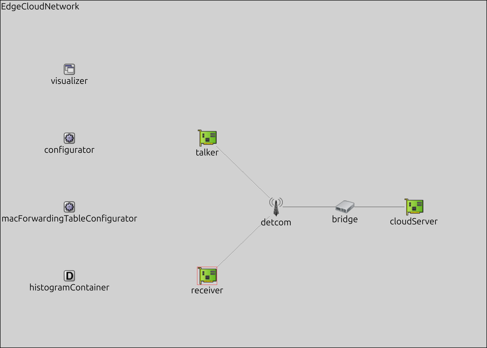
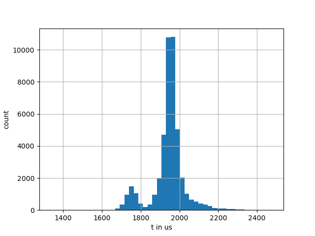

Edgecloud Showcase
==================

To add processing delay in edge cloud applications, we implemented a new application component for the simulator.
This showcase shows how to use this :ned:`UdpEdgeCloudApp` component to add processing delay to a simulation scenario.

Showcase Design and Implementation
----------------------------------

The following figure shows the design of the showcase scenario.

The following code snippet shows the configuration of the cloudServer device in Figure 14, where localPort is the port on which the UdpEdgeCloudApp9 is listening, and destAddress and destPort are the name of the destination device and destination port of the destination device, respectively.
The delay parameter contains the intended delay configuration.
In particular, every app of the cloud server has exactly one delay configuration, which is applied if a packet arrives at the specified localPort.
In order to specify different delays for different sources, one can create multiple apps with a different localPort and modify the source apps respectively.

.. code-block:: ini

    *.cloudServer.numApps = 1
    *.cloudServer.app[0].typename = "UdpEdgeCloudApp"
    *.cloudServer.app[0].destAddress = "receiver"
    *.cloudServer.app[0].destPort = 1002
    *.cloudServer.app[0].localPort = 1001
    *.cloudServer.app[0].delay = rngProvider("histogramContainer","Cloud")

Results
-------

If we execute a simulation using the first figure as an input distribution histogramCloud, we can see the resulting end-to-end delay of this stream follows the same distribution (second figure), i.e., the delay is added as intended.
Note, that the only network delay simulated in this simulation is the constant delay of Ethernet links, i.e. there is no PDV simulated by our :ned:`DetComDelayer`.

+----------+----------+
| |input|  | |output| |
+----------+----------+

.. |output| image:: output.png
   :width: 100%
