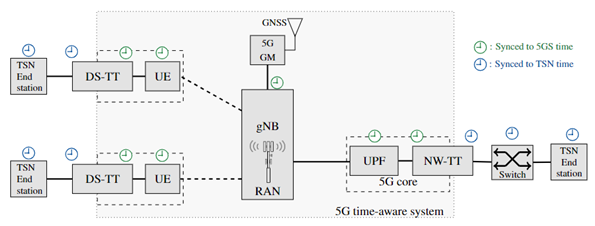
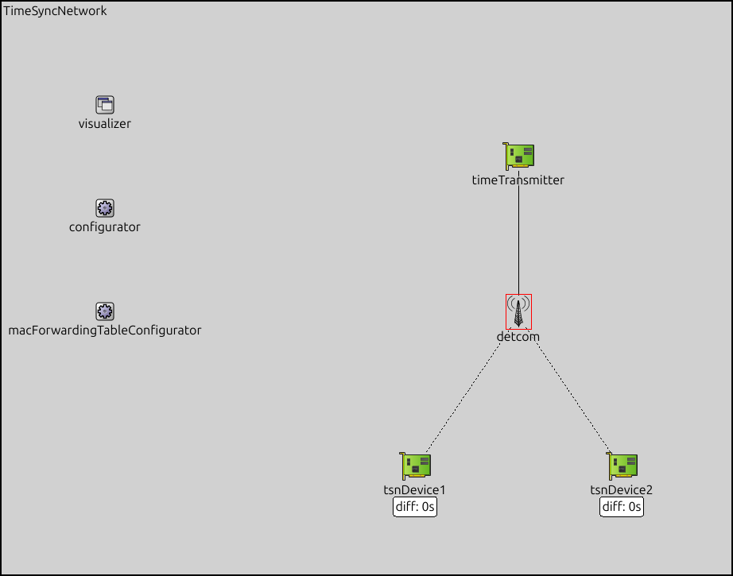

Time Synchronization Showcase
=============================

The time synchronization scenario of our simulation framework is used to analyze how gPTP performs in converged 5G/6G-TSN networks, in particular, when adding PDV.
For TSN networks, INET already supports time synchronization using the gPTP standard including showcases for different kinds of time synchronization networks.

As described in D2.2 Time synchronization for E2E time awareness and also shown in the figure below, converged 5G-TSN networks use two different time synchronization domains: the 5G time synchronization domain and the TSN time synchronization domain, respectively.
The 5G network components (UE, UPF) are synchronized within the 5G time synchronization domain.
The TSN time synchronization domain is synchronized to a time transmitter using the gPTP protocol.

As our :ned:`DetCom` node is based on the INET TsnSwitch, we can use its built in gPTP component in Bridge mode.
The following figure shows this setup using a time transmitter and two TSN devices synchronizing to the time transmitter (time receivers).

As described in more detail in D2.2, the 6GDetCom node has to be aware of gPTP frames and calculate the residence time of gPTP frames within the 6GDetCom node.
This works by setting an ingress timestamp t_i, when a gPTP frame enters the 6GDetCom node and an egress timestamp t_e, when the gPTP frame leaves the 6GDetCom node.
The residence time within the 6GDetCom node can then be calculated as t_e-t_i, which is then added to the correctionField of the gPTP frame.
This is consistent with the definition of TSN bridges and, thus, should work out-of-the-box with the INET framework and in our network presented above.

However, we discovered two problems with the current INET implementation of gPTP and the current simulation model.
First, the INET framework currently has an issue with its gPTP implementation which does not set correctionField correctly. (See `INET issue #920 <https://github.com/inet-framework/inet/issues/920>`_).
This problem is already under investigation by the developers of INET but has not been fixed yet.
Secondly, the abstraction made above assumes perfectly synchronized clocks within the 6G domain, i.e., t_i and t_e are synchronized within the 6G domain.
However, as D2.2 describes, the clocks in a 6G domain are not perfectly synchronized – note that in general there is a wireless link with stochastic delay between the components taking the timestamps t_i and t_e.
This means that t_i and t_e are set by different (usually not perfectly synchronized) clocks which leads to an inaccurate calculation t_e-t_i of the residence time.

Due to these two problems, we refrain from presenting preliminary results here, which would not be consistent with a real implementation.
Instead, we will tackle both problems in future work to gain meaningful simulation results for the time synchronization scenario.
First of all, we will fix the INET gPTP implementation to correctly set correctionField. Secondly, we will add a realistic clock model for the 5G domain in order to simulate the inaccurate calculation of the residence time, which impacts the accuracy of clock synchronization.
These extensions are subject to a future release of the simulation framework.

